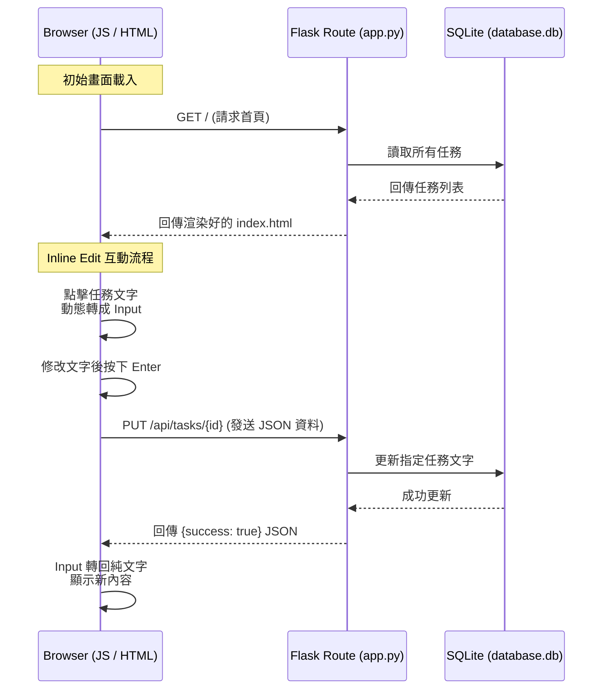

# 系統架構設計：每日待辦事項 (包含任務編輯功能)

## 1. 技術架構說明
本專案採用 Python 的 Flask 框架，搭配 SQLite 作為輕量級資料庫。雖然主要畫面由 Flask + Jinja2 渲染，但為了達成**不重新整理網頁的「任務編輯更新」功能**，前端將混合使用 Vanilla JavaScript (Fetch API) 來與後端溝通。

### MVC 模式 (Model-View-Controller)
- **Model (模型)**：負責與 SQLite 溝通，處理「任務」的資料結構（讀取、新增、更新、刪除）。
- **View (視圖)**：使用 Jinja2 渲染 HTML。針對任務編輯功能，會搭配 JS 動態將文字切換成 `<input>` 標籤。
- **Controller (控制器)**：Flask 的 Route 扮演此角色。負責接收前端的請求（如更新任務的 API 請求），呼叫 Model 更新資料庫，然後回傳成功與否的 JSON 狀態給前端 JS。

## 2. 專案資料夾結構
```text
daily-to-do-list/
├── app.py                 ← Flask 應用程式進入點與路由設定 (Controller/Model)
├── database.db            ← SQLite 資料庫檔案 (會在執行時自動產生)
├── docs/                  ← 專案文件 (PRD, Architecture 等)
├── static/                ← 靜態資源資料夾
│   ├── css/
│   │   └── style.css      ← 負責畫面美化與編輯狀態的視覺提示 (View)
│   └── js/
│       └── main.js        ← 處理 Inline Edit (點擊編輯) 與 Fetch API 請求 (View Logic)
└── templates/             ← HTML 模板資料夾
    └── index.html         ← 主畫面結構 (View)
```

> **備註：** 因為是分組作業且專注在單一功能，我們將架構稍微簡化，將路由(Route)與模型(Model)的簡易邏輯合併於 `app.py` 中，方便您開發與展示「任務編輯」功能。

## 3. 元件關係圖 (包含 Inline Edit 流程)



## 4. 關鍵設計決策
1. **使用 Fetch API 取代傳統表單送出：** 
   - **原因：** 傳統表單會導致頁面重新載入。為了給予使用者流暢的「點擊即編輯」體驗，必須透過 JS 非同步發送更新請求 (AJAX)。
2. **單一頁面架構 (SPA-like) 搭配 Jinja2：** 
   - **原因：** 初始資料由 Jinja2 在伺服器端渲染，有利於 SEO 與初次載入速度。但互動功能（如編輯）由 JS 處理，結合了兩者的優點。
3. **將 CSS 與 JS 獨立成靜態檔案：** 
   - **原因：** 保持 HTML 乾淨，且在分組作業中，負責前端互動與樣式的組員可以專心修改 `static/` 裡的檔案。
