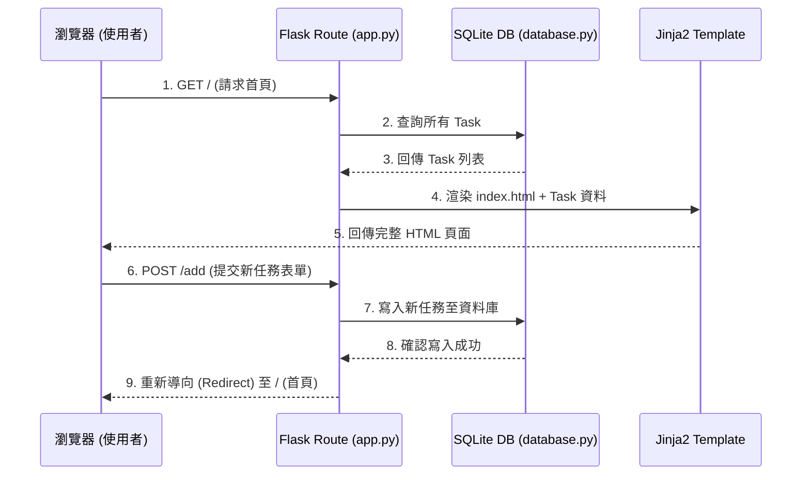

# 系統架構設計 - 每日代辦事項 (Daily To-Do List)

## 1. 技術架構說明

本專案採用經典的 Web 後端渲染架構，不使用前後端分離，以降低初期開發複雜度並確保專案輕量化。

### 選用技術與原因
- **後端：Python + Flask**
  - 原因：Flask 是輕量級的微框架，適合用來快速開發小型專案。它具備極高的靈活性，不會強制套用複雜的結構。
- **模板引擎：Jinja2**
  - 原因：與 Flask 原生整合良好。可以直接在 HTML 裡面寫入 Python 變數與邏輯（如 if/else、for 迴圈），將資料庫讀取的任務直接渲染成網頁。
- **資料庫：SQLite (透過 sqlite3)**
  - 原因：無須額外架設資料庫伺服器，資料會直接存在一個 `.db` 檔案中，完全符合單機/小型專案的需求。
- **前端樣式：HTML + Vanilla CSS**
  - 原因：手寫 CSS 可以高度客製化設計，並實作出更精緻的動畫與深色模式。

### Flask MVC 模式說明
雖然 Flask 本身不強制，但我們將依循 MVC (Model-View-Controller) 的概念來組織程式碼：
- **Model (模型)**：負責與 SQLite 資料庫溝通，處理「任務」的新增、讀取、更新、刪除 (CRUD)。
- **View (視圖)**：Jinja2 模板（`.html` 檔案），負責產生最終呈現給使用者的畫面。
- **Controller (控制器)**：Flask 的路由（Routes），負責接收使用者的請求 (如 GET 網頁或 POST 新增任務)，呼叫對應的 Model，最後將資料傳給 View 進行渲染。

## 2. 專案資料夾結構

```text
daily-to-do-list/
├── app.py                # 應用程式入口，包含 Flask 初始化與所有的 Routes (Controller)
├── database.py           # 負責建立與管理 SQLite 連線與基本設定 (Model)
├── schema.sql            # 初始化資料庫的 SQL 腳本 (定義 tasks 資料表)
├── static/               # 靜態資源資料夾
│   └── css/
│       └── style.css     # 全域樣式表，包含所有的色彩、排版與動畫設計
├── templates/            # Jinja2 模板資料夾 (View)
│   ├── base.html         # 基礎 HTML 骨架，包含 Header、Footer 與共用資源引入
│   └── index.html        # 首頁模板，負責渲染代辦事項清單與輸入框
├── instance/             # 存放特定於此環境的檔案，不該進入版本控制
│   └── daily_todo.db     # SQLite 資料庫檔案 (由程式自動產生)
└── docs/                 # 專案說明文件與設計文件 (PRD, Architecture 等)
```

> **注意**：因專案規模較小，我們將路由 (Routes) 直接寫在 `app.py` 中，而與資料庫互動的邏輯則抽出到 `database.py` 方便管理。

## 3. 元件關係圖



## 4. 關鍵設計決策

1. **路由集中化**
   - 決策：所有的 Flask Route 寫在同一個 `app.py`。
   - 原因：對於單一資源（只有 Task）的專案來說，使用 Blueprints 會顯得過度設計。集中在 `app.py` 能讓初學者更快掌握全貌。
2. **手寫原生 SQL**
   - 決策：不使用 SQLAlchemy，而是使用 Python 內建的 `sqlite3` 手寫 SQL 語法。
   - 原因：本專案的資料表極少（只有一個 Task 表），手寫 SQL 有助於開發者理解背後的資料庫運作原理，並減少對外部大型函式庫的依賴。
3. **Template 繼承機制**
   - 決策：建立 `base.html` 並讓 `index.html` 繼承它。
   - 原因：雖然目前只有一頁，但這是一個好的習慣。未來若要增加「關於我們」或「設定」頁面，可以確保網站的 Navbar 和基礎 CSS 樣式保持一致，不需重複撰寫。
