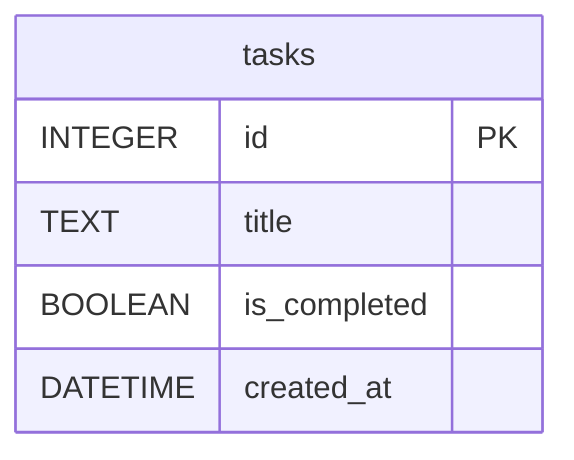

# 資料庫設計 - 每日代辦事項 (Daily To-Do List)

## 1. ER 圖 (實體關係圖)

本專案採極簡化設計，目前僅有一個資料表 `tasks` 來儲存代辦事項。

## 2. 資料表詳細說明

### `tasks` 資料表

用來儲存使用者的每一筆代辦事項。

| 欄位名稱 | 型別 | 必填 | 預設值 | 說明 |
| --- | --- | --- | --- | --- |
| `id` | INTEGER | 是 | (自動遞增) | Primary Key (主鍵)，唯一識別碼 |
| `title` | TEXT | 是 | 無 | 代辦事項的文字內容 |
| `is_completed` | BOOLEAN | 是 | 0 (False) | 0 代表未完成，1 代表已完成 |
| `created_at` | DATETIME | 是 | CURRENT_TIMESTAMP | 任務建立的時間戳記 |

## 3. Python Model 程式碼 (database.py)

根據架構設計，我們會把資料庫互動邏輯集中在 `database.py`。
它將包含以下功能：
1. `init_db()`: 執行 `schema.sql` 建立資料表。
2. `get_db_connection()`: 取得與 SQLite 資料庫的連線。
3. `get_all_tasks()`: 取得所有代辦事項（可依建立時間排序）。
4. `add_task(title)`: 新增代辦事項。
5. `toggle_task_status(task_id)`: 切換任務完成狀態。
6. `delete_task(task_id)`: 刪除任務。
7. `update_task_title(task_id, new_title)`: 更新任務標題。
