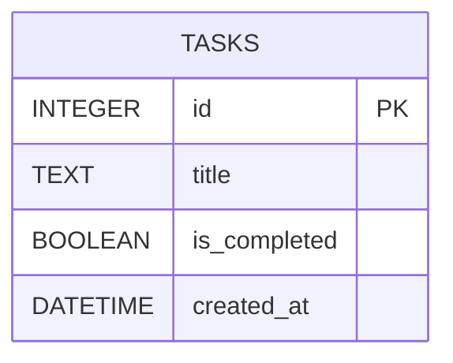

# 資料庫設計：每日待辦事項 (任務資料表)

為了配合我們簡化的架構與您的「任務編輯」分組任務，資料庫設計將保持簡潔，主要圍繞 `tasks` 資料表。

## 1. ER 圖（實體關係圖）

## 2. 資料表詳細說明

### `tasks` (任務表)

這是系統中唯一也是最核心的資料表。

| 欄位名稱 | 型別 | 必填 | 說明 |
|---|---|---|---|
| `id` | INTEGER | 是 | Primary Key，自動遞增的唯一識別碼 |
| `title` | TEXT | 是 | 任務的文字內容，也是您負責**「編輯與更新」的主要目標欄位** |
| `is_completed` | BOOLEAN | 是 | 任務狀態 (0 代表未完成，1 代表已完成) |
| `created_at` | DATETIME | 是 | 建立時間，預設為當下時間 |

## 3. SQL 建表語法

完整的建表與測試資料插入語法已儲存於專案根目錄的 `schema.sql` 檔案中。未來在 `app.py` 中將會自動讀取並初始化資料庫。
