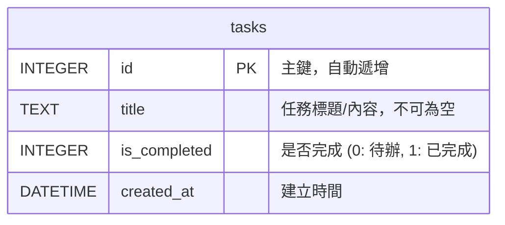

# 資料庫設計 (DB Design)

## 1. ER 圖 (實體關係圖)
本專案目前只需要一個簡單的資料表來儲存任務資訊。



## 2. 資料表詳細說明

### `tasks` (任務表)
負責儲存使用者的待辦事項。
- **`id`** (`INTEGER`): 主鍵 (Primary Key)，自動遞增，用來唯一識別一筆任務。
- **`title`** (`TEXT`): 任務的文字內容。由於這是極簡設計，我們將標題與描述合併在一個欄位，必填。
- **`is_completed`** (`INTEGER`): 記錄任務是否完成。在 SQLite 中通常以 `0` 代表 `False` (待辦)，`1` 代表 `True` (已完成)，預設值為 `0`。
- **`created_at`** (`DATETIME`): 記錄任務建立的時間，預設為 `CURRENT_TIMESTAMP`，以便後續依照建立時間排序。

## 3. SQL 建表語法
此語法將儲存於 `database/schema.sql`，並在 Flask 初始化資料庫時被執行。

```sql
DROP TABLE IF EXISTS tasks;

CREATE TABLE tasks (
    id INTEGER PRIMARY KEY AUTOINCREMENT,
    title TEXT NOT NULL,
    is_completed INTEGER DEFAULT 0,
    created_at TIMESTAMP DEFAULT CURRENT_TIMESTAMP
);
```

## 4. Python Model 程式碼規劃
我們將在 `app/models/task.py` 實作以下方法 (此為規劃，實作細節於程式碼階段完成)：
- `get_db_connection()`: 建立並回傳 `sqlite3` 連線。
- `get_all_tasks()`: 查詢並回傳所有任務，可依據 `created_at` 排序。
- `create_task(title)`: 新增一筆任務。
- `toggle_task_status(task_id)`: 取得目前的 `is_completed` 狀態，並將其反轉 (0變1，1變0)。
- `delete_task(task_id)`: 刪除指定的任務。
