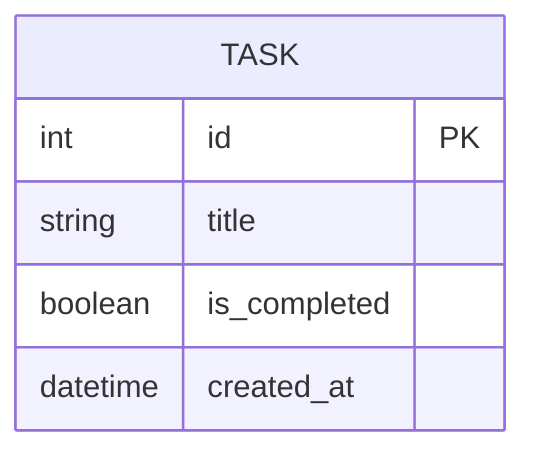

# DB DESIGN: 每日代辦 (Daily To-Do List) 資料庫設計

本文件根據 PRD 與系統架構，定義 SQLite 資料庫的 Schema 與 ORM 模型。

## 1. ER 圖（實體關係圖）

本系統目前為單一使用者版本的輕量級應用，因此只需要一張核心資料表來儲存任務資料。



## 2. 資料表詳細說明

### TASK 資料表

負責儲存使用者建立的所有代辦事項。

| 欄位名稱 | 型別 (SQL) | ORM 型別 | 必填 | 預設值 | 說明 |
| --- | --- | --- | --- | --- | --- |
| `id` | INTEGER | Integer | 是 | (Auto Increment) | 任務的唯一識別碼 (Primary Key) |
| `title` | TEXT | String(200) | 是 | 無 | 任務的名稱/內容 |
| `is_completed` | BOOLEAN | Boolean | 是 | `False` | 標記任務是否已完成 (0 = 否, 1 = 是) |
| `created_at` | DATETIME | DateTime | 是 | 目前時間 | 任務建立的時間戳記 |

## 3. SQL 建表語法

雖然專案使用 Flask-SQLAlchemy 進行資料庫操作（可自動產生資料表），但附上原生 SQLite 語法供參考與除錯使用。
該語法已儲存於 `database/schema.sql`。

```sql
CREATE TABLE task (
    id INTEGER NOT NULL, 
    title VARCHAR(200) NOT NULL, 
    is_completed BOOLEAN NOT NULL, 
    created_at DATETIME NOT NULL, 
    PRIMARY KEY (id)
);
```

## 4. Python Model 程式碼

專案選用 `Flask-SQLAlchemy` 作為 ORM。
Model 程式碼已建立於 `app/models.py`。
Model 包含 `id`, `title`, `is_completed`, `created_at` 等欄位，並支援 SQLAlchemy 內建的 CRUD 操作機制。
