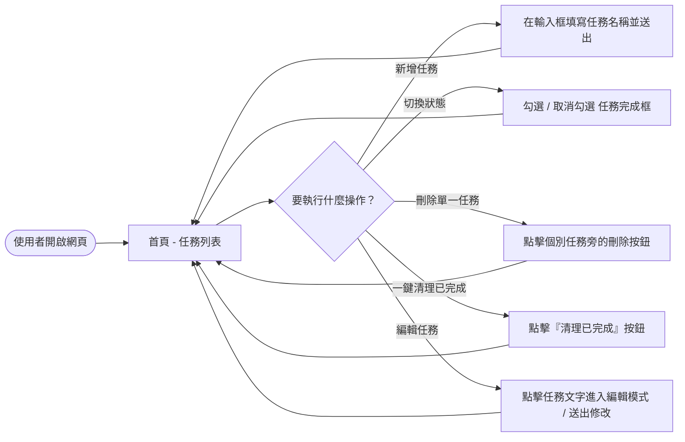
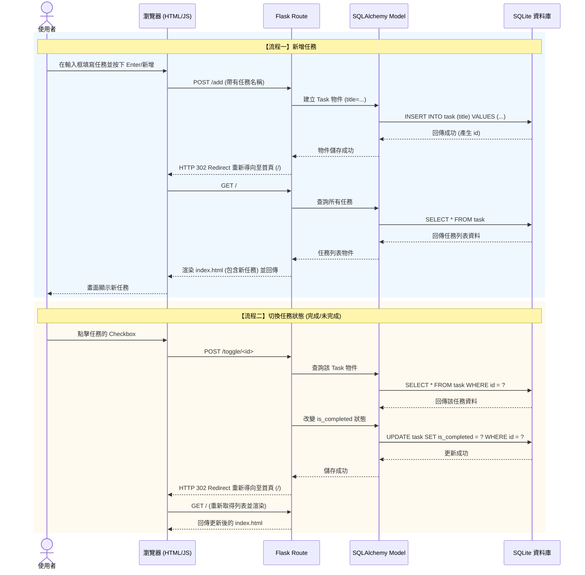

# FLOWCHART: 每日代辦 (Daily To-Do List) 流程圖設計

本文檔透過視覺化圖表說明「每日代辦」系統中，使用者的操作路徑（User Flow）與系統內部的資料流動（Sequence Diagram）。

## 1. 使用者流程圖（User Flow）

描述使用者進入網頁後，進行各項代辦任務操作的路徑。本專案採單頁面設計模式，所有主要操作皆在首頁完成。

## 2. 系統序列圖（Sequence Diagram）

以下序列圖以「**新增任務**」與「**切換任務狀態**」為例，展示前端瀏覽器、Flask 路由、資料庫模型與 SQLite 之間的互動。

## 3. 功能清單對照表

本表列出系統所有的主要功能與其對應的 URL 路徑、HTTP 方法及功能描述。

| 功能 | URL 路徑 | HTTP 方法 | 功能描述 |
| --- | --- | --- | --- |
| 瀏覽首頁 | `/` | GET | 顯示所有任務的列表（包含已完成與未完成區塊）。 |
| 新增任務 | `/add` | POST | 接收表單提交的任務名稱，新增到資料庫中。 |
| 切換狀態 | `/toggle/<int:task_id>` | POST | 將指定的任務狀態在「完成」與「未完成」間切換。 |
| 刪除單一任務 | `/delete/<int:task_id>` | POST | 從資料庫中刪除指定的任務。 |
| 編輯任務 | `/edit/<int:task_id>` | POST | 更新指定任務的文字內容。 |
| 一鍵清理已完成 | `/clear-completed` | POST | 將資料庫中所有標記為「已完成」的任務刪除。 |

> **設計備註**：為了確保資料修改的安全性與符合 HTTP 規範，所有會修改資料庫狀態的操作（新增、切換、刪除、清理、編輯）皆使用 `POST` 方法，而非 `GET` 方法。操作完成後統一 `Redirect` 回首頁 `/` 以避免重新整理造成表單重複送出。
