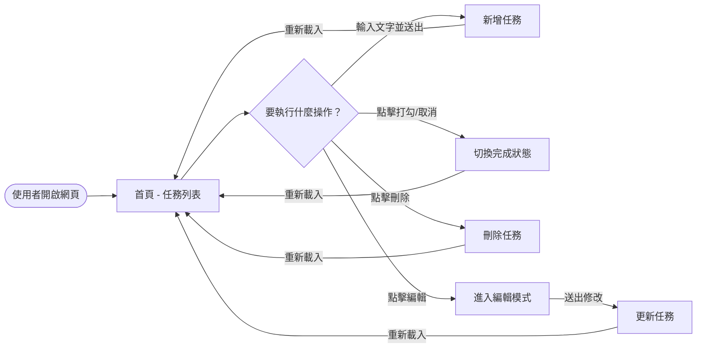
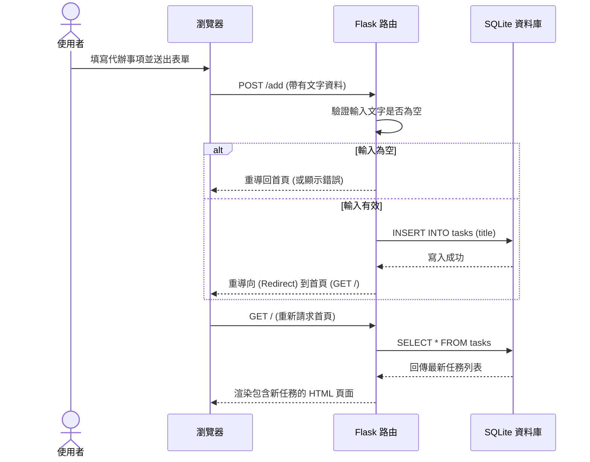

# 流程圖設計 - 每日代辦事項 (Daily To-Do List)

## 1. 使用者流程圖 (User Flow)

這張圖描述了使用者進入網站後可以執行的各種操作路徑。

## 2. 系統序列圖 (Sequence Diagram)

這裡我們以「新增任務」為例，展示從使用者點擊送出到資料寫入資料庫的完整流程。

## 3. 功能清單對照表

以下是系統所有功能與其對應的 URL 路徑與 HTTP 方法：

| 功能描述 | HTTP 方法 | URL 路徑 | 說明 |
| --- | --- | --- | --- |
| 檢視任務清單 | GET | `/` | 載入首頁並顯示所有任務 |
| 新增任務 | POST | `/add` | 接收表單資料，寫入後重導向回首頁 |
| 切換完成狀態 | POST | `/toggle/<int:task_id>` | 切換任務的完成/未完成狀態，然後重導向回首頁 |
| 刪除任務 | POST | `/delete/<int:task_id>` | 刪除特定任務，然後重導向回首頁 |
| 編輯任務 | POST | `/edit/<int:task_id>` | 更新特定任務的標題文字，然後重導向回首頁 |

> 註：在傳統的 HTML 表單中，我們只能使用 GET 或 POST 方法。因此上述操作（即使是刪除或更新）我們也一律使用 POST 方法配合特定的 URL 路徑來達成。
