# 流程圖：每日待辦事項 (任務編輯功能)

## 1. 使用者流程圖 (User Flow)

這張圖展示了使用者在畫面上的操作路徑，專注於任務的 Inline 編輯過程。

```mermaid
flowchart LR
    A([開啟待辦事項首頁]) --> B[檢視任務列表]
    B --> C{使用者動作}
    C -->|滑鼠移至任務| D[顯示可編輯提示<br>(游標變更/背景微調)]
    D -->|點擊任務文字| E[文字轉換為輸入框]
    E --> F[修改內容]
    F --> G{儲存方式}
    G -->|按下 Enter 鍵| H[發送儲存請求]
    G -->|點擊輸入框外部 (Blur)| H
    H --> I[切換回純文字並顯示新內容]
```

## 2. 系統序列圖 (Sequence Diagram)

這張圖展示了當使用者修改任務並按下 Enter 後，前端與後端資料庫的非同步通訊流程 (AJAX/Fetch)。

```mermaid
sequenceDiagram
    actor User as 使用者
    participant Browser as 瀏覽器 (JS)
    participant Flask as Flask (app.py)
    participant DB as SQLite

    User->>Browser: 點擊任務文字
    Browser->>Browser: 將文字 <span> 隱藏，顯示 <input> 並 Focus
    User->>Browser: 修改文字並按下 Enter
    Browser->>Browser: 鎖定輸入框避免重複送出
    Browser->>Flask: 發送 PUT /api/tasks/{id} <br/> (帶有 JSON 資料)
    Flask->>DB: 執行 UPDATE SQL 語法
    DB-->>Flask: 成功更新
    Flask-->>Browser: 回傳 JSON { "success": true, "title": "新內容" }
    Browser->>Browser: 隱藏 <input>，更新 <span> 內容並顯示
    Browser-->>User: 畫面呈現更新後的任務文字
```



## 3. 功能清單對照表

本階段針對首頁與編輯功能的 API 設計如下：

| 功能名稱 | URL 路徑 | HTTP 方法 | 說明 |
|---|---|---|---|
| 載入首頁 | `/` | `GET` | 渲染 Jinja2 模板，回傳帶有任務列表的 HTML |
| 更新任務 | `/api/tasks/<int:id>` | `PUT` | 接收前端發送的 JSON 資料並更新，回傳成功與否的 JSON |
