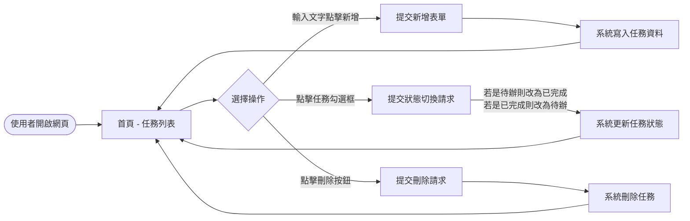
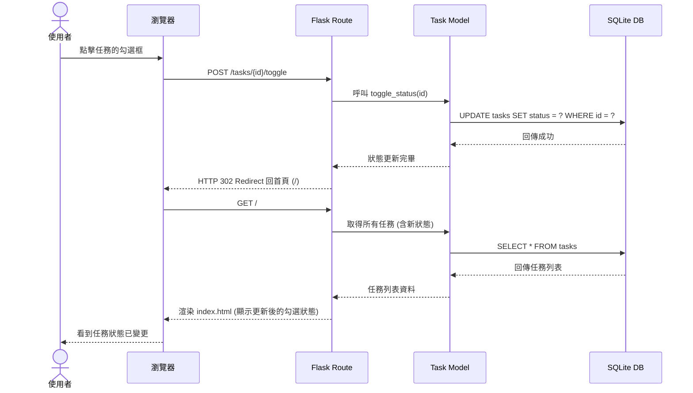

# 流程圖設計 (Flowchart)

## 1. 使用者流程圖 (User Flow)
這份流程圖描述了使用者進入「每日代辦事項」網站後，可能的操作路徑與交互體驗。

## 2. 系統序列圖 (Sequence Diagram)
這份序列圖以最核心的「標記完成/未完成」功能為例，描述了瀏覽器、Flask 後端與 SQLite 資料庫之間的完整溝通流程。

## 3. 功能清單對照表
統整所有操作與對應的路由端點：

| 功能操作 | HTTP 方法 | URL 路徑 | 對應流程結果 |
| :--- | :---: | :--- | :--- |
| **檢視首頁** | `GET` | `/` | 顯示所有任務的列表 |
| **新增任務** | `POST` | `/tasks` | 寫入資料後重導向至 `/` |
| **切換狀態** | `POST` | `/tasks/<id>/toggle` | 更新狀態後重導向至 `/` |
| **刪除任務** | `POST` | `/tasks/<id>/delete` | 刪除資料後重導向至 `/` |
